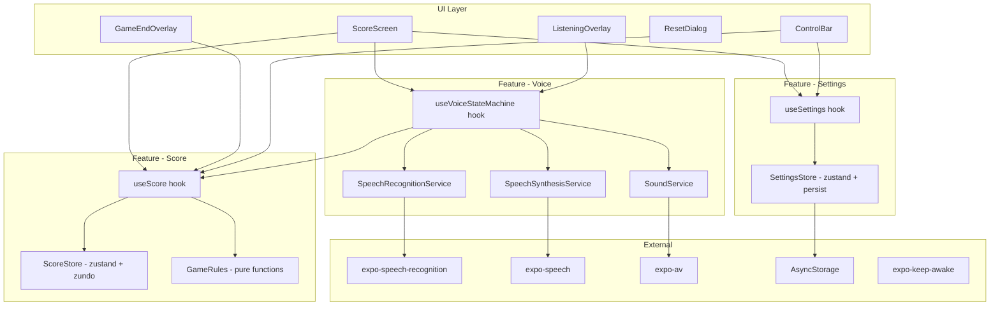
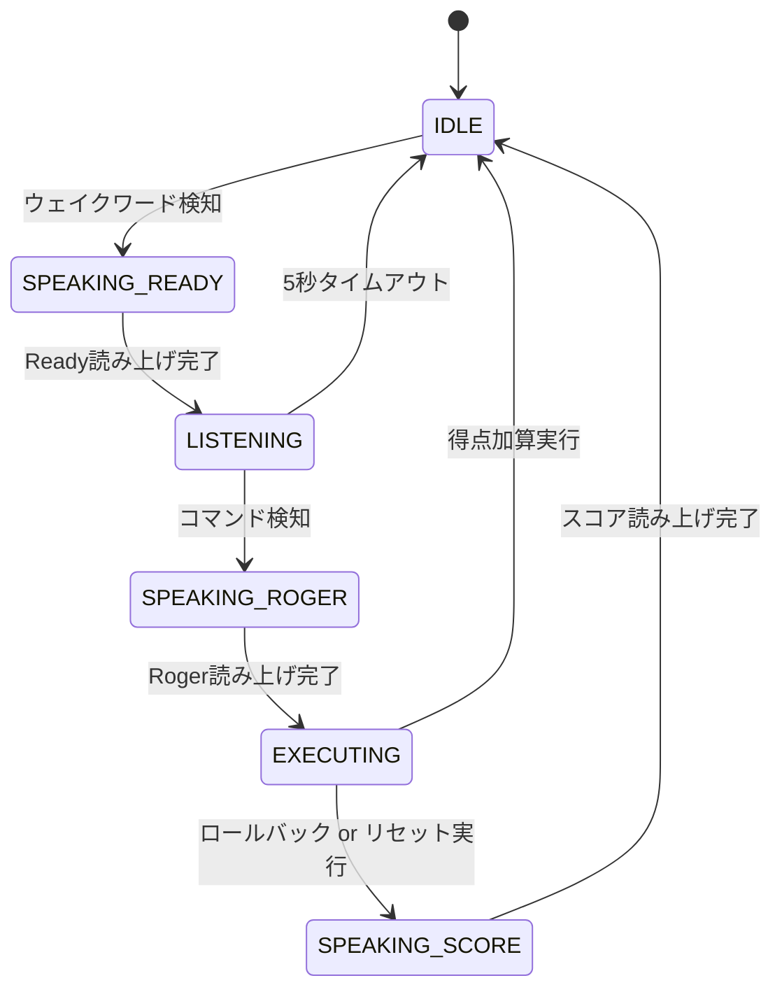
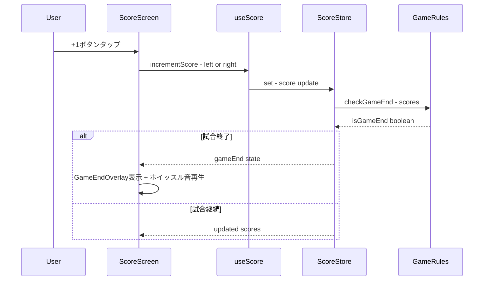
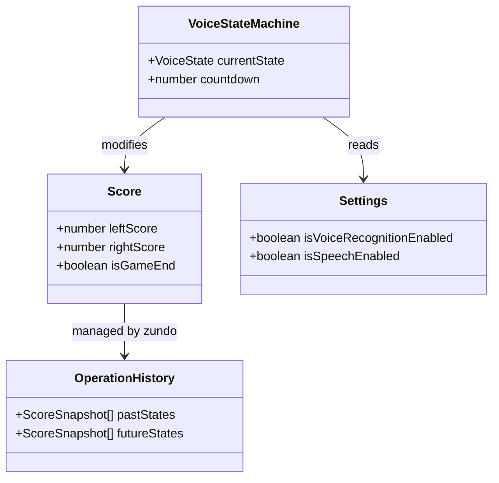

# Design Document

## Overview

**Purpose**: 音声操作対応スポーツスコアボードアプリ（Voice Scoreboard）は、バレーボール練習時に得点板の代わりとして音声とタッチの両方でスコアを管理できるモバイルアプリを提供する。

**Users**: 部活動・サークルの練習参加者、草試合の運営者が、得点板がない環境で得点管理に使用する。

**Impact**: 新規アプリケーション（グリーンフィールド）。React Native + Expo によるクロスプラットフォームモバイルアプリとして構築する。

### Goals
- 音声コマンド（K.I.T.T.スタイル状態マシン）とタッチ操作の両方でスコア管理を実現
- 6人制バレーボールの試合ルール（25点マッチ・デュース対応）を自動適用
- オフラインで安定動作し、体育館などのネットワーク不安定環境で使用可能

### Non-Goals
- v1.0ではセットカウント管理、試合履歴保存、チーム名カスタマイズは対象外
- 複数競技対応はv2.0以降
- 声紋認証・オーバーコール機能はv2.0以降
- サーバー通信・クラウド連携

## Visual Design

### デザインカンプ

| 画面状態 | ファイル |
|---------|---------|
| メイン画面（IDLE） | `docs/01_design/images/scoreboard-main.png` |
| LISTENING状態 | `docs/01_design/images/scoreboard-listening.png` |
| リセット確認ダイアログ | `docs/01_design/images/scoreboard-reset-confirm.png` |
| 試合終了画面 | `docs/01_design/images/scoreboard-reset-on-gameset.png` |

### カラーパレット

| 用途 | 色 | 参考値 |
|------|---|--------|
| 背景 | ダークネイビー | `#0f172a`（slate-900相当） |
| スコア数字 | 白（グロー効果付き） | `#ffffff` + `textShadow` で発光表現 |
| アクセント（LISTENING系） | シアン | `#00e5ff`（cyan-400相当） |
| アクセント（試合終了系） | ゴールド/アンバー | `#f59e0b`（amber-500相当） |
| 危険操作（リセットボタン） | 赤 | `#ef4444`（red-500相当） |
| ボタン（通常） | ダークグレー | `#334155`（slate-700相当） |
| ボタンボーダー | グレー | `#475569`（slate-600相当） |
| トグルボタン（有効時） | シアン | `#06b6d4`（cyan-500相当） |
| 下部バー背景 | ダークネイビー（やや明るめ） | `#1e293b`（slate-800相当） |

### 画面別ビジュアル仕様

#### メイン画面（IDLE）

- **レイアウト**: 横画面、左右均等分割。中央に細い縦の分割線
- **スコア数字**: 白、極大サイズ（画面高さの40%程度）。`textShadow` による白色グロー効果
- **+1 / -1 ボタン**: ダークグレー背景の角丸ボタン。各スコアの下に横並びで配置
- **下部バー**: 画面下端に固定
  - 左側: 「音声入力」「読み上げ」トグルボタン（有効時シアン背景、アイコン + ラベル付き）
  - 右側: 「ロールバック」「リセット」ボタン（ダークグレー背景、ボーダー付き、アイコン + ラベル）

#### LISTENING状態

- **オーバーレイ**: 画面中央にシアンの同心円発光リング（グラデーション）+ マイクアイコン（白）
- **テキスト**: リングの下に「Ready」（シアン）
- **カウントダウン**: 「Ready」の下に秒数表示（例: `1s`）。白またはグレー
- **背景効果**: 背景のスコア・ボタンにブラー（`blur`）+ ディム（暗転）を適用。下部バーはそのまま表示

#### リセット確認ダイアログ

- **背景効果**: 画面全体にディム + ブラー
- **ダイアログカード**: ダークネイビー背景、角丸、薄いグレーのボーダー
  - タイトル: 「リセット確認」（白、太字）
  - 説明文: 「スコアを 0-0 にリセットしますか？」（グレー）
  - ボタン: 「キャンセル」（ダークグレー背景）、「リセット」（赤背景、白文字）

#### 試合終了画面

- **オーバーレイ**: ゴールド/アンバーの枠線付きカード（角丸、中央配置）
- **テキスト**: 「試合終了」（ゴールド/アンバー、大きめ太字）
- **リセットボタン**: ゴールド/アンバー背景、白文字。オーバーレイ内に配置
- **+1 / -1 ボタン**: 非表示（`display: none` 相当。無効化ではなく完全に非表示）
- **背景効果**: スコアはディム表示（暗転）。下部バーはそのまま表示
- **演出**: ゴールドの発光/グロー効果をオーバーレイ枠線に適用

## Architecture

### Architecture Pattern & Boundary Map

Feature-based + Clean Architecture 軽量版を採用（README.mdで決定済み）。



**Architecture Integration**:
- Selected pattern: Feature-based + Clean Architecture 軽量版。機能ごとにディレクトリ分割し、hooks（UseCase相当）でロジックを分離
- Domain boundaries: score / voice / settings の3機能。各featureは独立してテスト可能
- New components rationale: 全て新規（グリーンフィールド）
- Steering compliance: CLAUDE.mdのアーキテクチャ指針に準拠

### Technology Stack

| Layer | Choice / Version | Role in Feature | Notes |
|-------|------------------|-----------------|-------|
| Framework | React Native + Expo SDK 52 | クロスプラットフォームモバイルアプリ | Development Build必須 |
| 音声認識 | `expo-speech-recognition` (SDK 52対応) | ウェイクワード検知 + コマンド認識 | `@react-native-voice/voice` から変更（アーカイブ済み）。詳細は `research.md` |
| 音声読み上げ | `expo-speech` 13.0.1 | Ready/Roger応答 + スコア読み上げ | 日本語 ja-JP 対応 |
| 効果音再生 | `expo-av` 15.0.2 | ホイッスル音再生 | SDK 52で安定。SDK 53+で expo-audio に移行予定 |
| 状態管理 | `zustand` 5.x + `zundo` | スコア管理 + 操作履歴（undo） | `zundo` でロールバック機能 |
| 永続化 | `@react-native-async-storage/async-storage` | 設定の保存・復元 | zustand persist ミドルウェア経由 |
| スリープ防止 | `expo-keep-awake` 14.0.3 | 画面常時点灯 | useKeepAwake hook |
| スタイリング | `nativewind` 4.1.x | Tailwind CSSによるUI構築 | v5はプレリリースのためv4を採用 |

## System Flows

### 音声コマンド状態マシン



**Key Decisions**:
- SPEAKING_READY / SPEAKING_ROGER / SPEAKING_SCORE 状態を追加。音声認識と読み上げの排他制御を状態マシンで保証する
- 読み上げ中は音声認識を停止し、完了コールバックで次の状態に遷移
- IDLE→SPEAKING_READY遷移時に音声認識を一旦停止→Ready読み上げ→LISTENING開始で認識を再開

### 得点操作フロー（タッチ）



## Requirements Traceability

| Requirement | Summary | Components | Interfaces | Flows |
|-------------|---------|------------|------------|-------|
| 1.1 | 横画面で左右分割スコア表示 | ScoreScreen, ScorePanel | - | - |
| 1.2 | 大きな数字で得点表示 | ScorePanel | - | - |
| 1.3 | ダークモード背景 | ScoreScreen | NativeWind dark: | - |
| 2.1 | +1ボタンで加算 | ScorePanel, useScore | ScoreStore | 得点操作フロー |
| 2.2 | -1ボタンで減算 | ScorePanel, useScore | ScoreStore | 得点操作フロー |
| 2.3 | ロールバック | ControlBar, useScore | ScoreStore + zundo | 得点操作フロー |
| 2.4 | リセット確認ダイアログ | ResetDialog, useScore | ScoreStore | - |
| 2.5 | リセット実行 | ResetDialog, useScore | ScoreStore | - |
| 3.1 | 25点到達 + 2点差で試合終了 | GameRules | checkGameEnd | 得点操作フロー |
| 3.2 | デュース継続 | GameRules | checkGameEnd | - |
| 3.3 | 試合終了表示 + ホイッスル音 | GameEndOverlay, SoundService | SoundService | - |
| 3.4 | 試合終了時の操作無効化 | useScore | ScoreStore.isGameEnd | - |
| 3.5 | 試合終了時リセットのみ許可 | GameEndOverlay, useScore | ScoreStore | - |
| 3.6 | 試合終了からのリセット | GameEndOverlay, useScore | ScoreStore | - |
| 4.1 | 常時リスニング IDLE状態 | useVoiceStateMachine, SpeechRecognitionService | VoiceState | 音声コマンド状態マシン |
| 4.2 | ウェイクワード検知 Ready応答 | useVoiceStateMachine, SpeechSynthesisService | VoiceState | 音声コマンド状態マシン |
| 4.3 | LISTENING状態のUI表示 | ListeningOverlay | VoiceState | - |
| 4.4 | 5秒カウントダウン表示 | ListeningOverlay | VoiceState | - |
| 4.5 | 5秒タイムアウトでIDLE復帰 | useVoiceStateMachine | VoiceState | 音声コマンド状態マシン |
| 5.1-5.4 | 音声コマンドでスコア操作 | useVoiceStateMachine, useScore | VoiceCommand | 音声コマンド状態マシン |
| 5.5 | コマンド実行後IDLE復帰 | useVoiceStateMachine | VoiceState | 音声コマンド状態マシン |
| 6.1-6.2 | Ready/Roger読み上げ | SpeechSynthesisService | SpeechSynthesisService | 音声コマンド状態マシン |
| 6.3-6.5 | スコア読み上げルール | useVoiceStateMachine, SpeechSynthesisService | - | 音声コマンド状態マシン |
| 6.6 | ホイッスル音 | SoundService | SoundService | - |
| 7.1 | 画面スリープ防止 | ScoreScreen | useKeepAwake | - |
| 8.1-8.5 | 設定管理 | ControlBar, useSettings | SettingsStore | - |
| 9.1-9.5 | パフォーマンス・非機能要件 | 全コンポーネント | - | - |

## Components and Interfaces

| Component | Domain/Layer | Intent | Req Coverage | Key Dependencies | Contracts |
|-----------|-------------|--------|--------------|------------------|-----------|
| ScoreScreen | UI | メイン画面。横画面スコアボード全体 | 1.1, 1.3, 7.1 | useScore, useVoiceStateMachine, useSettings | - |
| ScorePanel | UI | 左右チームのスコア表示 + +1/-1ボタン | 1.2, 2.1, 2.2 | useScore | - |
| ListeningOverlay | UI | LISTENING状態のオーバーレイ表示 | 4.3, 4.4 | useVoiceStateMachine | - |
| GameEndOverlay | UI | 試合終了オーバーレイ + リセットボタン | 3.3, 3.5, 3.6 | useScore, SoundService | - |
| ResetDialog | UI | リセット確認モーダル | 2.4, 2.5 | useScore | - |
| ControlBar | UI | 下部バー。トグル + ロールバック/リセット | 2.3, 8.1, 8.2 | useScore, useSettings | - |
| useScore | Score/Hook | スコア操作ロジック。加算/減算/ロールバック/リセット/試合終了判定 | 2.1-2.5, 3.1-3.6 | ScoreStore, GameRules | State |
| ScoreStore | Score/Store | zustand + zundo によるスコア状態管理 | 2.1-2.5, 3.4 | zundo | State |
| GameRules | Score/Service | 試合ルールの純粋関数群 | 3.1, 3.2 | なし | Service |
| useVoiceStateMachine | Voice/Hook | K.I.T.T.スタイル音声状態マシン | 4.1-5.5, 6.1-6.5 | SpeechRecognitionService, SpeechSynthesisService, useScore | State |
| SpeechRecognitionService | Voice/Service | expo-speech-recognition のラッパー | 4.1, 4.2, 5.1-5.4 | expo-speech-recognition (P0) | Service |
| SpeechSynthesisService | Voice/Service | expo-speech のラッパー | 6.1-6.4 | expo-speech (P0) | Service |
| SoundService | Voice/Service | expo-av による効果音再生 | 6.6 | expo-av (P0) | Service |
| useSettings | Settings/Hook | 設定管理ロジック | 8.1-8.5 | SettingsStore | State |
| SettingsStore | Settings/Store | zustand + persist による設定永続化 | 8.5 | AsyncStorage (P0) | State |

### Score Domain

#### GameRules

| Field | Detail |
|-------|--------|
| Intent | 6人制バレーボールの試合ルール判定（純粋関数） |
| Requirements | 3.1, 3.2 |

**Responsibilities & Constraints**
- 試合終了判定のみを担当。副作用なし
- 入力: 両チームのスコア。出力: 試合終了かどうか
- ルール変更に備え、パラメータ化可能にする（将来の複数競技対応を考慮）

**Dependencies**
- なし（純粋関数）

**Contracts**: Service [x]

##### Service Interface
```typescript
interface GameRulesConfig {
  readonly matchPoint: number;      // 25
  readonly deuceThreshold: number;  // 24
  readonly pointGap: number;        // 2
}

interface GameRulesService {
  checkGameEnd(leftScore: number, rightScore: number, config: GameRulesConfig): boolean;
  isDeuce(leftScore: number, rightScore: number, config: GameRulesConfig): boolean;
}
```
- Preconditions: scores >= 0
- Postconditions: 結果はboolean。副作用なし
- Invariants: config は不変

#### ScoreStore

| Field | Detail |
|-------|--------|
| Intent | スコア状態の管理と操作履歴の保持 |
| Requirements | 2.1-2.5, 3.4 |

**Responsibilities & Constraints**
- 左右チームのスコアを保持
- zustand + zundo による操作履歴管理
- 試合終了状態の管理
- 試合終了時はリセット以外の操作を拒否

**Dependencies**
- External: `zundo` — undo/redo ミドルウェア (P0)

**Contracts**: State [x]

##### State Management
```typescript
interface ScoreState {
  readonly leftScore: number;
  readonly rightScore: number;
  readonly isGameEnd: boolean;
}

interface ScoreActions {
  incrementLeft(): void;
  incrementRight(): void;
  decrementLeft(): void;
  decrementRight(): void;
  reset(): void;
}

type ScoreStore = ScoreState & ScoreActions;
```
- State model: `{ leftScore, rightScore, isGameEnd }`
- Persistence: なし（メモリのみ）
- Concurrency: 単一ユーザー操作のため考慮不要

#### useScore

| Field | Detail |
|-------|--------|
| Intent | スコア操作のビジネスロジック。UIとStoreの仲介 |
| Requirements | 2.1-2.5, 3.1-3.6 |

**Responsibilities & Constraints**
- 得点操作時にGameRulesで試合終了判定を実行
- 試合終了時の操作制限を適用
- zundo の `undo()` を使ったロールバック

**Dependencies**
- Inbound: ScoreScreen, ControlBar, useVoiceStateMachine — スコア操作 (P0)
- Outbound: ScoreStore — 状態更新 (P0)
- Outbound: GameRules — 試合終了判定 (P0)

**Contracts**: Service [x]

##### Service Interface
```typescript
interface UseScoreReturn {
  readonly leftScore: number;
  readonly rightScore: number;
  readonly isGameEnd: boolean;
  readonly canUndo: boolean;
  incrementScore(side: 'left' | 'right'): void;
  decrementScore(side: 'left' | 'right'): void;
  rollback(): void;
  reset(): void;
}
```

### Voice Domain

#### SpeechRecognitionService

| Field | Detail |
|-------|--------|
| Intent | expo-speech-recognition のラッパー。音声認識の開始/停止/結果取得 |
| Requirements | 4.1, 4.2, 5.1-5.4 |

**Responsibilities & Constraints**
- 音声認識の開始・停止・中断
- 認識結果のイベント通知
- `contextualStrings` でコマンド語彙の認識精度向上
- Android固有の `androidIntentOptions` 設定

**Dependencies**
- External: `expo-speech-recognition` — 音声認識エンジン (P0)

**Contracts**: Service [x]

##### Service Interface
```typescript
type SpeechRecognitionMode = 'wakeword' | 'command';

interface SpeechRecognitionOptions {
  readonly mode: SpeechRecognitionMode;
  readonly lang: string;
  readonly onResult: (transcript: string, isFinal: boolean) => void;
  readonly onEnd: () => void;
  readonly onError: (error: string) => void;
}

interface SpeechRecognitionService {
  start(options: SpeechRecognitionOptions): void;
  stop(): void;
  abort(): void;
  isAvailable(): Promise<boolean>;
  requestPermissions(): Promise<boolean>;
}
```
- Preconditions: マイク権限が許可されていること
- Postconditions: `onResult` で認識結果を通知
- Invariants: 同時に1つの認識セッションのみ

**Implementation Notes**
- wakeword モード: `continuous: true`、`interimResults: true` で開始。セッションを維持し再起動ループ不要。予期外終了時は useVoiceStateMachine で再開始
- command モード: `contextualStrings: ['右', '左', 'ロールバック', 'リセット']` を設定。5秒後に `stop()` を呼び出し

#### SpeechSynthesisService

| Field | Detail |
|-------|--------|
| Intent | expo-speech による音声読み上げ |
| Requirements | 6.1-6.4 |

**Responsibilities & Constraints**
- テキストの音声読み上げ
- 読み上げ完了コールバックの提供
- 日本語 ja-JP ロケール使用

**Dependencies**
- External: `expo-speech` — TTS エンジン (P0)

**Contracts**: Service [x]

##### Service Interface
```typescript
interface SpeechSynthesisService {
  speak(text: string, onDone: () => void): void;
  stop(): void;
  isSpeaking(): Promise<boolean>;
}
```
- Preconditions: なし
- Postconditions: `onDone` で読み上げ完了を通知

#### SoundService

| Field | Detail |
|-------|--------|
| Intent | expo-av によるホイッスル音などの効果音再生 |
| Requirements | 6.6 |

**Responsibilities & Constraints**
- ローカルアセットからの音声ファイル再生
- 再生完了後のリソース解放

**Dependencies**
- External: `expo-av` — オーディオ再生 (P0)

**Contracts**: Service [x]

##### Service Interface
```typescript
type SoundType = 'whistle';

interface SoundService {
  play(type: SoundType): Promise<void>;
  preload(): Promise<void>;
}
```

#### useVoiceStateMachine

| Field | Detail |
|-------|--------|
| Intent | K.I.T.T.スタイル音声状態マシンのオーケストレーション |
| Requirements | 4.1-5.5, 6.1-6.5 |

**Responsibilities & Constraints**
- IDLE→SPEAKING_READY→LISTENING→SPEAKING_ROGER→EXECUTING→SPEAKING_SCORE→IDLE の状態管理
- 音声認識と読み上げの排他制御
- 5秒タイムアウトの管理
- ウェイクワード「スコア」とコマンド語彙の判定
- 設定（音声認識ON/OFF、読み上げON/OFF）の反映

**Dependencies**
- Inbound: ScoreScreen, ListeningOverlay — 状態参照 (P0)
- Outbound: SpeechRecognitionService — 音声認識 (P0)
- Outbound: SpeechSynthesisService — 音声読み上げ (P0)
- Outbound: SoundService — 効果音 (P1)
- Outbound: useScore — スコア操作 (P0)
- Outbound: useSettings — 設定参照 (P1)

**Contracts**: State [x]

##### State Management
```typescript
type VoiceState =
  | 'IDLE'
  | 'SPEAKING_READY'
  | 'LISTENING'
  | 'SPEAKING_ROGER'
  | 'EXECUTING'
  | 'SPEAKING_SCORE';

type VoiceCommand = 'right' | 'left' | 'rollback' | 'reset';

interface UseVoiceStateMachineReturn {
  readonly state: VoiceState;
  readonly countdown: number;
  start(): void;
  stop(): void;
}
```

### Settings Domain

#### SettingsStore

| Field | Detail |
|-------|--------|
| Intent | 設定の永続化管理 |
| Requirements | 8.1-8.5 |

**Responsibilities & Constraints**
- 音声認識 ON/OFF、読み上げ ON/OFF の管理
- zustand persist ミドルウェアによるAsyncStorageへの永続化
- アプリ起動時の設定復元（ハイドレーション）

**Dependencies**
- External: `@react-native-async-storage/async-storage` — 永続化ストレージ (P0)

**Contracts**: State [x]

##### State Management
```typescript
interface SettingsState {
  readonly isVoiceRecognitionEnabled: boolean;
  readonly isSpeechEnabled: boolean;
}

interface SettingsActions {
  toggleVoiceRecognition(): void;
  toggleSpeech(): void;
}

type SettingsStore = SettingsState & SettingsActions;
```
- Persistence: AsyncStorage（zustand persist ミドルウェア経由）
- Consistency: 設定変更は即座にAsyncStorageに永続化

## Data Models

### Domain Model



**Business Rules & Invariants**:
- `leftScore >= 0` かつ `rightScore >= 0`
- `isGameEnd == true` の場合、`incrementLeft()` / `incrementRight()` / `decrementLeft()` / `decrementRight()` / `rollback()` は無効（リセットのみ有効）
- 試合終了条件: `(left >= 25 || right >= 25) && |left - right| >= 2`、ただし `left < 24 || right < 24` の場合は `max(left, right) >= 25 && |left - right| >= 2`

## Error Handling

### Error Strategy
- **Fail Fast**: マイク権限未許可時は音声機能を無効化し、UIで通知
- **Graceful Degradation**: 音声認識が利用不可の場合はタッチ操作のみで完全に動作

### Error Categories and Responses
**User Errors**: マイク権限拒否 → 設定画面への誘導。音声認識できない発話 → 5秒タイムアウトでIDLEに復帰
**System Errors**: 音声認識エンジン初期化失敗 → 音声機能を自動的にOFFにし、タッチ操作モードにフォールバック。効果音ファイル読み込み失敗 → エラーログ出力、音なしで続行

## Testing Strategy

### Unit Tests
- `GameRules.checkGameEnd()`: 通常勝利、デュース、デュース後の勝利、0-0、24-24 等のパターン
- `GameRules.isDeuce()`: デュース判定の境界値テスト
- `ScoreStore`: 加算/減算/リセット/試合終了状態でのガード
- `VoiceCommand` パーサー: 「右」「左」「ロールバック」「リセット」の判定

### Integration Tests
- `useScore` + `ScoreStore` + `GameRules`: スコア操作→試合終了判定→状態更新の一連フロー
- `useVoiceStateMachine` の状態遷移: IDLE→LISTENING→IDLE のサイクル
- `SettingsStore` + `AsyncStorage`: 設定の保存・復元サイクル
- zundo undo/redo: スコア変更→ロールバック→スコア復元

### E2E Tests（将来: Maestro）
- 音声コマンドによるスコア操作フロー（実機テストで検証）
- タッチ操作によるスコア操作フロー
- 試合終了→リセット→新しい試合フロー

## Performance & Scalability

- アプリ起動: 3秒以内（Req 9.1）。expo-keep-awakeとzustand hydrationの初期化を並列実行
- 音声レスポンス: 1秒以内（Req 9.2）。状態マシン遷移を最小限に保ち、音声認識結果のパース処理を軽量に
- オフライン動作（Req 9.3）: サーバー通信なし。音声認識はデバイスのオンデバイスモデルを使用（利用可能な場合）
